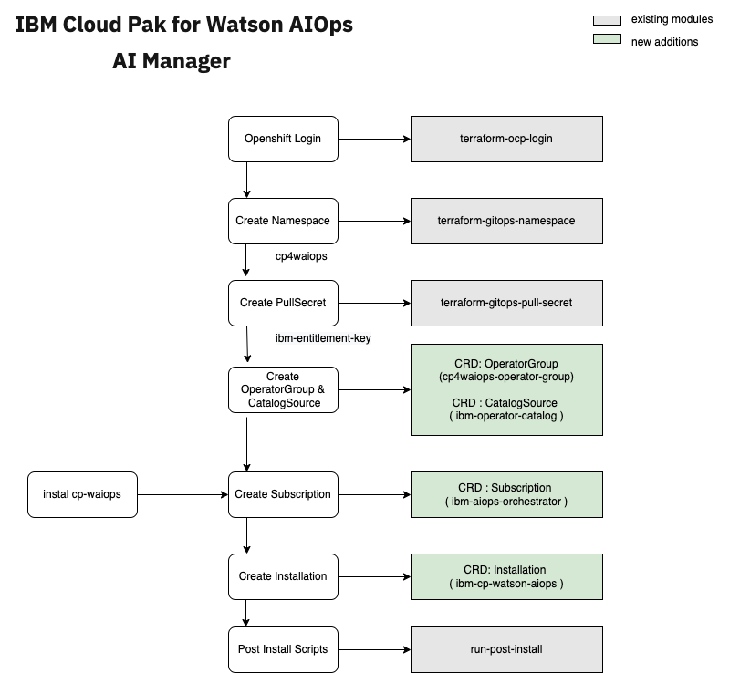

# terraform-gitops-cp-waiops-infra-automation

This terraform module will create a gitops configuration to deploy an instance of IBM Cloud Pak for Watson AIOps Infra Automation.

## Software dependencies

The module depends on the following software components:

### Command-line tools

- terraform - v12
- kubectl

### Terraform providers

- IBM Cloud provider >= 1.5.3
- Helm provider >= 1.1.1 (provided by Terraform)

## Module dependencies

This module makes use of the output from other modules:

- Namespace - https://github.com/cloud-native-toolkit/terraform-ocp-login
- GitOps - https://github.com/cloud-native-toolkit/terraform-util-gitops-bootstrap
- GitOps - https://github.com/cloud-native-toolkit/terraform-tools-gitops
- Namespace - https://github.com/cloud-native-toolkit/terraform-gitops-namespace
- etc


## Example usage

(To be corrected......)

```hcl-terraform
module "ibm-cp-waiops-infra-automation" {
  source = "github.com/cloud-native-toolkit/terraform-gitops-cp-waiops-infra-automation.git"

  gitops_config = module.gitops.gitops_config
  git_credentials = module.gitops.git_credentials
  server_name = module.gitops.server_name
  namespace = module.gitops_namespace.name
  kubeseal_cert = module.gitops.sealed_secrets_cert
  entitlement_key = var.entitlement_key
  storageClass = var.storageClass
  storageClassLargeBlock = var.storageClassLargeBlock
}
```

## Overview




## References

1. SWE execution in local environment  : https://github.com/diimallya/swe-local-execution-guide
2. Module catalog https://modules.cloudnativetoolkit.dev/


