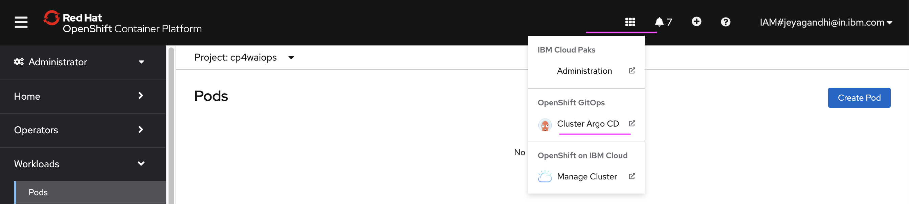

# SWE execution in local environment

This documentation demonstrates the steps to test the developed IBM SWE gitops module locally by pointing to desired OpenShift cluster and GitHub repository.

## 1. Update terraform.tfvars

Update the below properties in `/test/stages/terraform.tfvars` file .

#### 1.1 ibmcloud_api_key

Generate the key from  https://cloud.ibm.com/iam/apikeys

#### 1.2 cp_entitlement_key

Get the entitlement key from  https://myibm.ibm.com/products-services/containerlibrary

#### 1.3 server_url

The server where you are going to apply the terraform module.

The `oc login` command of the OCP cluster would be like this.

```
oc login --token=sha256~62DwshrR-4tR2w_..............i8dx8 --server=https://c117-e.us-south.containers.cloud.ibm.com:11111
```
Here the `server_url` is `https://c117-e.us-south.containers.cloud.ibm.com:11111`

#### 1.4 login_token

From the above exmaple, the `login_token` is `sha256~62DwshrR-4tR2w_..............i8dx8`

#### 1.5 namespace

The namespace could be `cp4waiops` where this module is going to run.

#### 1.6 git_org

Create new org in github and give the value. 

Click the `New Organization` button in https://github.com/settings/organizations  to create new Org.

#### 1.7 git_username

You github user name

#### 1.8 git_token

You github Personal access token.

Click the `Generate New Token` button in https://github.com/settings/tokens to create token

#### 1.9 git_repo

Give any non existing github repo name. This will be created while running this module.

## 2. Install yq4

yq is needed to run locally.

1. Make sure that you are in the root folder of this repo `terraform-gitops-cp-waiops-draft`. 

2. Create the below folders by running the below commands

```
mkdir test/stages/bin
mkdir test/stages/bin2
```

3. Run the below command to install `yq`

```
brew install yq 
```

4. Run the below command to copy the `yq` and `yq4` executable inside `test/stages/bin2`

```
sudo cp /usr/local/bin/yq ./test/stages/bin2/
sudo cp /usr/local/bin/yq ./test/stages/bin2/yq4
```

5. Run yq4

Run the `yq4` to test whether it is copied. 

```
./test/stages/bin2/yq4
```

6. Make sure it has execute permission.

## 3. Install kubeseal

Make sure that you are in the root folder of this repo `terraform-gitops-cp-waiops-draft`. 

1, Run the below command to install `kubeseal`

```
brew install kubeseal
sudo cp /usr/local/bin/kubeseal ./test/stages/bin/
```

2, Run the below command to copy `kubeseal`

```
sudo cp /usr/local/bin/kubeseal ./test/stages/bin/
```


## 4. Create Symbolic link

Create a symbolic link to current module code execution `stage2-xxxxxxxx.tf) `  by running following commands.
1. Goto the `test/stages` directory

```
cd  test/stages
```

2. Run the below command


```
ln -s ../.. module
```

## 5. Run Terraform Module

Make sure you are in  `test/stages` directory:

1. Run the below command

```
terraform init
```
This will download all required modules in `.terraform` directory inside `test/stages`.

2. Run the below command

```
terraform plan
```
This will make a dry-run and provides a list of resources to be added/destroyed and also any syntax/reference errors.

3. Run the below command

```
terraform apply --auto-approve
```
This command will provision resources in mentioned cluster.


## 6. Open ArgoCD

1. Open the ArgoCD



2. ArgoCD Credentials

- UserName : admin
- Passowrd : Is stored in  `./test/stages/.tmp/argocd-password.val`

Run the below command to print the password.

```
cat ./test/stages/.tmp/argocd-password.val
```

3. View the Sync details of all the application created.

## 7. Destroying the module


### 7.1 Terraform Destroy

1. Goto the `test/stages` directory

2. Run the below command

```
terraform destroy
```
This will remove all the ArgoCD deployments and github repo created by the automation.

### 7.2 OpenShift Cleanup

After terraform destroy is completed, to make OpenShift cluster reusable further cleaning can be done using following steps in OpenShift console.

1. Delete the below namespaces created by script.

```
openshift-pipelines
openshift-gitops
sealed-secret
cp4waiops (namespace of the module)
```

```
oc delete ns openshift-pipelines
oc delete ns openshift-pipelines
oc delete ns sealed-secret
oc delete ns cp4waiops
```


2. Goto `Operators > Installed Operators` and Uninstall the below operators installed by this module

```
openshift-pipeline
openshift-gitops
```

3. Delete the aove namespaces again, if they have been recreated by this time.

4. Make sure namespaces get deleted and not in `Terminating` state anymore. 

If it continues to be in `Terminating` state run the shell script [./files/01-delete-stuck-namespaces.sh](./files/01-delete-stuck-namespaces.sh) by passing the namespace as argument.

ex:

```
sh ./files/1-delete-stuck-namespaces.sh cp4waiops
```

### 7.3 Delete Temp files

1. Make sure that you are in the root folder of this repo `terraform-gitops-cp-waiops-draft`. 

2. Run the below command to delete temp folders and files.

```
rm -rfd ./test/stages/.terraform
rm -rfd ./test/stages/.tmp
rm -rfd ./test/stages/tmp
rm -rfd ./test/stages/gitops
rm -rfd ./test/stages/gh_2.5.2_macOS_amd64

rm ./test/stages/terraform.tfstate
rm ./test/stages/terraform.tfstate.backup
rm ./test/stages/.terraform.lock.hcl
rm ./test/stages/.kubeconfig
rm ./test/stages/git_repo
rm ./test/stages/git_token
rm ./test/stages/gitops-output.json
rm ./test/stages/.namespace

rm ./test/stages/.module


```